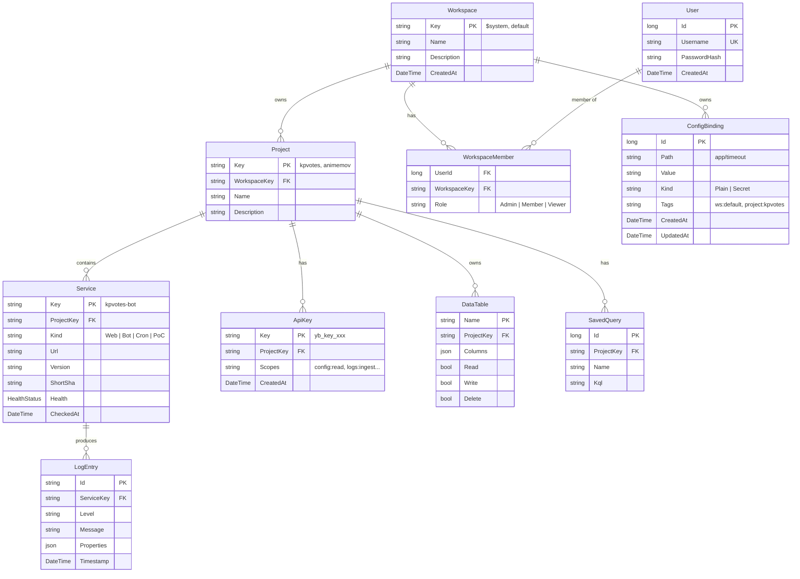

# PetBox — Specification

> **Historical document (frozen)** — not a working plan/spec. Live status and plan live in PetBox ($system boards); see AGENTS.md.

Module monolith for pet-project infrastructure. Config, logging, data access, dashboard — one service, feature-toggled subsystems. Код собран из портов yobaconf и yobalog плюс новых модулей.

Эта спека — живой документ в репе. Vault-копия (`my/idea/petbox/spec.md`) считается архивной.

---

## Модель сущностей



### Workspace: организационный слой над Project

Workspace — корневая организационная единица. Один или несколько проектов внутри. Существует `$system` workspace для самообслуживания и `default` для остального. Каждый workspace хранит:

- Свой ConfigDb (`data/config/{workspaceKey}.db`) через `ConfigDbFactory`.
- Своих пользователей (`WorkspaceMember` с ролями Admin/Member/Viewer).
- Список проектов.

### ConfigBinding: tag-based, ws обязателен

ConfigBinding живёт в per-workspace SQLite-БД. Тег `ws:{workspaceKey}` обязателен. Project/Service — автотеги при создании в контексте:

- Binding на уровне Project → `ws:default, project:kpvotes, shared`
- Binding на уровне Service → `ws:default, project:kpvotes, service:kpvotes-bot`
- Ручные теги: `env:production`, `region:eu`

Resolve pipeline: клиент передаёт теги, получает наиболее специфичный binding (max tag-match). `Kind=Secret` → значение маскируется в UI/API, раскрывается только по AJAX-запросу авторизованного пользователя.

### LogEntry: per-project LogDb

LogDb живёт per-project (`data/logs/{projectKey}.db`) через `LogDbFactory`. Service создаётся → ingest принимает логи по `ServiceKey`. Никакой отдельной сущности «лог-поток» нет.

Append-only, immutable. Retention применяется per-project (см. ниже).

### Tracing/Spans

Span живёт в той же per-project LogDb (отдельная таблица). OTLP-приём через Seq.E.Logging + собственный ingestion endpoint. UI: страницы Traces/Trace с waterfall.

### DataTable

Админ создаёт таблицы через UI. Разработчик работает через API. На MVP — отложено (`Features:Data=false`).

### ApiKey и scopes

Один ключ на проект, гранулярные разрешения:

```
yb_key_x7k2m... → project: kpvotes, scopes: [config:read, logs:ingest, data:write]
```

Scopes:
- `config:read`, `config:write`
- `logs:ingest`, `logs:query`
- `data:read`, `data:write`, `data:delete`
- `dashboard:read`
- `admin`

---

## Авторизация

Auth — выделенный модуль в PetBox.Core. Две схемы:

- **Cookie** для UI (Login → User-таблица → claims: UserId, активный WorkspaceKey).
- **ApiKey** через `X-Api-Key` для API (ApiKeyAuthenticationHandler → claims: ProjectKey, Scopes).

`PolicyScheme("Smart")` выбирает по наличию `X-Api-Key` заголовка.

### Local vs Remote mode

**Main instance** валидирует через свой PetBoxDb. **Log-only instance** делегирует валидацию ApiKey на main через `GET /api/auth/validate` (cached 60s, см. `RemoteAuthHandler`).

```json
// Main:
{ "Auth": { "Mode": "local" }, "Features": { "Config": true, "Logging": true, "Data": false, "Dashboard": true } }

// Log-only:
{ "Auth": { "Mode": "remote", "RemoteUrl": "https://petbox.3po.su", "RemoteCacheSeconds": 60 },
  "Features": { "Config": false, "Logging": true, "Data": false, "Dashboard": false } }
```

### WorkspaceMember roles

- **Admin** — CRUD проектов/сервисов/ключей внутри workspace, управление пользователями workspace.
- **Member** — чтение всего, запись config/data в рамках workspace.
- **Viewer** — только чтение.

Роли применяются к UI-страницам через policies (`WorkspaceAdmin`, `WorkspaceMember`, `WorkspaceViewer`). ApiKey scopes остаются на уровне API независимо от ролей.

---

## URL-структура

Чёткое разделение UI и API namespace через префиксы.

### UI (`/ui/...`, требуется cookie-auth)

```
/ui/login
/ui/dashboard
/ui/dashboard/{projectKey}
/ui/logs/{projectKey?}
/ui/logs/{projectKey}/traces
/ui/logs/{projectKey}/traces/{traceId}
/ui/share/{token}                 — публичные share-ссылки на KQL-результат
/ui/config/{workspaceKey?}
/ui/config/edit
/ui/config/history
/ui/config/preview
/ui/config/tags
/ui/admin                         — landing → workspaces
/ui/admin/workspaces
/ui/admin/workspaces/{key}/users
/ui/admin/projects
/ui/admin/projects/{key}
/ui/admin/retention
```

### API (`/api/...`, ApiKey-auth или AllowAnonymous)

```
/api/auth/validate                — для remote-auth log-only instance
/api/auth/logout                  — UI logout (cookie)
/api/ingest/clef                  — CLEF ingestion, X-Api-Key + X-Service-Key
/api/events/raw                   — raw structured events
/api/logs/{projectKey}/query      — KQL запрос
/api/logs/{projectKey}/services   — список сервисов
/api/logs/{projectKey}/live-tail  — SSE для live-tail
/api/logs/{projectKey}/completions — KQL autocomplete
/api/config/{workspaceKey}/resolve
/api/config/{workspaceKey}/bindings
/api/config/{workspaceKey}/bindings/{id}/reveal — раскрытие Secret
/api/data/{table}                 — CRUD данных (если Features:Data=true)
/api/share                        — создание share-link
```

`/health`, `/version` — AllowAnonymous, без префикса.

---

## Project-centric UI

Project — точка входа в навигацию. Дашборд → логи проекта → конфиги workspace.

```
/ui/dashboard                          — все проекты с цветовыми индикаторами
/ui/dashboard/kpvotes                  — детали проекта: сервисы, health, последние ошибки
/ui/logs/kpvotes                       — логи проекта (все сервисы)
/ui/logs/kpvotes?service=kpvotes-bot   — фильтр по сервису через KQL
/ui/config/default                     — конфиги workspace (tag-based)
/ui/admin/projects                     — CRUD проектов и сервисов
/ui/admin/projects/kpvotes             — детали: services + keys
```

Из дашборда клик по сервису → логи этого сервиса (уже отфильтрованные).

---

## Технологический стек

| Слой | Решение | Почему |
|---|---|---|
| **.NET** | 10, Web SDK | — |
| **БД (Core/Config/Log/Data)** | SQLite + linq2db 6.3.0 | единый стек |
| **Миграции Core** | FluentMigrator | `.cs`-файлы, транзакции |
| **Per-workspace ConfigDb** | `ConfigDbFactory` | `data/config/{wsKey}.db`, авто-миграция |
| **Per-project LogDb** | `LogDbFactory` | `data/logs/{projectKey}.db`, авто-миграция |
| **Config engine** | tag-based key-value | из yobaconf, без YAML/HOCON |
| **KQL engine** | Kusto.Language + kusto-loco | портирован из yobalog |
| **Seq ingestion** | Seq.Extensions.Logging | |
| **OTLP** | Protobuf + Grpc.Tools | для логов и спанов |
| **OTel tracing** | AspNetCore only | |
| **Frontend** | Razor Pages + htmx + Alpine.js | bundled через bun |
| **CSS** | Tailwind 3.4 + daisyUI 4 | |
| **TS-бандлер** | tsc | строже, уже в yobaconf |
| **E2E browser** | Lightpanda | как в KpVotes |
| **Docker** | chiseled noble, `/app/data` volume | |
| **Сборка** | Cake (Clean→Restore→Version→Build→Test→Docker→Push) | |
| **CI/CD** | GitHub Actions + SSH deploy | |

---

## Self-logging: паттерн `$system`

PetBox логирует сам себя в собственный LogModule:

```
Workspace "$system" (неудаляемый)
└── Project "$system"
    ├── Service "petbox-web"       — HTTP запросы, ошибки
    ├── Service "petbox-config"    — resolve pipeline
    ├── Service "petbox-log"       — ingest, KQL-запросы
    └── Service "petbox-dashboard" — HealthPoller, CiPoller
```

`Seq.Extensions.Logging` → собственный `/api/ingest/clef` endpoint при `Features:Logging=true` и `Seq:SelfLog:Enabled=true`.

---

## Hard invariants

- **Feature toggle gating.** Каждый модуль проверяет `Features:<Name>` перед регистрацией endpoints / middleware / BackgroundServices. Выключенный модуль = ноль runtime-стоимости.
- **Auth: local + remote режимы.** По умолчанию local. Log-only инстансы не хранят пользователей и ключей.
- **`$system` workspace + project неудаляемы.** Автосоздаются на первом старте через миграции.
- **Config resolve детерминирован.** Те же теги → тот же binding. Max tag-match wins.
- **`ws:` тег обязателен в ConfigBinding.** Невалидный binding отвергается на create/update.
- **ApiKey scopes — enumerable, не wildcard.**
- **LogEntry append-only, immutable.** Retention — единственный путь удаления.
- **Span хранится в той же per-project LogDb.**
- **Никакого PetBox self-config через ConfigModule.** PetBox конфигурируется через `appsettings.json`.
- **Localization с первого дня.** Все user-facing строки через `IStringLocalizer`. Chrome UI на английском, без кириллицы/иврита/арабского.
- **`data-testid` для UI селекторов.** Никаких text-match или CSS-class-селекторов в E2E.
- **No HTML в `.cs` файлах.** Вся разметка в `.cshtml`.
- **No inline JS в Razor.** Вся клиентская логика в `ts/`, собирается bun.
- **Frontend build — Release-only.** Debug использует `bun run dev` watcher.

---

## Фазы

### Phase 0–4: Scaffold + порт ядра yobaconf/yobalog [DONE]

- Solution + проекты + Core models + FluentMigrator + Auth (cookie + ApiKey)
- Config engine (tag-based resolve) + базовый Config UI
- Log engine (KQL + CleF ingestion) + базовый Logs UI
- Admin (Projects/Services/ApiKeys CRUD), Dashboard skeleton
- E2E KpVotes onboarding + scope enforcement + config priority

### Phase 5: Workspaces + multi-user [DONE/IN PROGRESS]

- Workspace + User + WorkspaceMember модели + миграции
- Login через User-таблицу, role-based authz
- Per-workspace ConfigDb, per-project LogDb через factories
- `/ui` + `/api` URL prefix split

### Phase 6: Полный порт Config UI [IN PROGRESS]

- ConfigBinding.Kind (Plain | Secret)
- Полный Bindings/Index с фильтрами и фасетами тегов
- Полный Editor с key=value tag textarea, validation, conflict detection
- Secret reveal (10s раскрытие через AJAX)
- Страницы History (audit-log), Preview (resolve preview), Tags (вокабуляр)

### Phase 7: Полный порт Logs UI [IN PROGRESS]

- Rich `_EventRow` с template substitution + `_EqNeChips` (✓/✗ chips)
- `_KqlCompletions` partial + endpoint
- `_RowsFragment` с cursor-based infinite scroll (htmx intersect)
- `logs.ts`: hotkey toast, `/`-focus, pin/sticky search, copy-to-clipboard, expandable rows, live-tail staging

### Phase 8: Live-tail backend

- `ChannelIngestionPipeline` + `InMemoryTailBroadcaster` (порт из yobalog)
- SSE endpoint `/api/logs/{project}/live-tail`
- Подключение тогла в logs UI

### Phase 9: Sharing module

- ShareLink + KqlShareLink модели + Store
- FieldMaskingPolicy + ValueMasker
- TsvExporter
- Страница `/ui/share/{token}`, POST `/api/share`

### Phase 10: Retention

- RetentionPolicy модель + Store (в PetBoxDb)
- RetentionService BackgroundService
- Применяется per-project через LogDbFactory
- Страница `/ui/admin/retention`

### Phase 11: Tracing/Spans

- Span модель + SqliteSpanStore (в per-project LogDb)
- Страницы Traces/Trace + `_TraceWaterfall`
- OTLP ingest endpoint для спанов

### Phase 12: Data module [DEFERRED]

Сейчас `Features:Data=false`. Когда вернёмся:
- Уточнить дизайн: PostgREST-совместимый API или простой CRUD
- Миграция таблиц данных
- Где хранятся: `data/databases/{projectKey}.db`?

### Phase 13: Миграция прода

- Деплой PetBox на `3po.su` рядом с yobaconf/yobalog
- Поочерёдное переключение трафика
- yobaconf/yobalog → архив (read-only)

---

## Риски

| Риск | Смягчение |
|---|---|
| **Полузаведённая Workspace-модель** | Phase 5 закрывает: Login через User, role-based authz, миграция дефолтного админа в Users |
| **Дрифт спеки и кода** | Этот документ перенесён в репу — обновляется вместе с кодом |
| **Lightpanda ограничения** | E2E использует Playwright поверх Lightpanda; проверять обнаруженные ограничения |
| **Data module** | Выключен флагом до уточнения дизайна |
