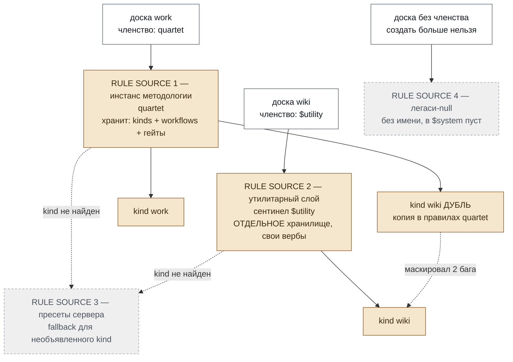
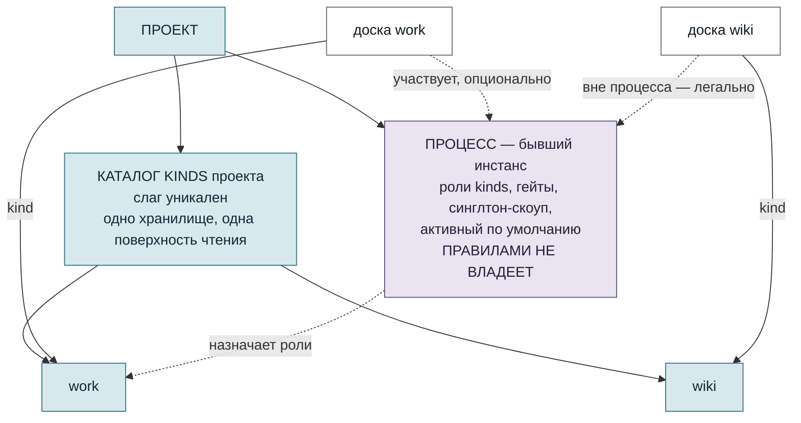
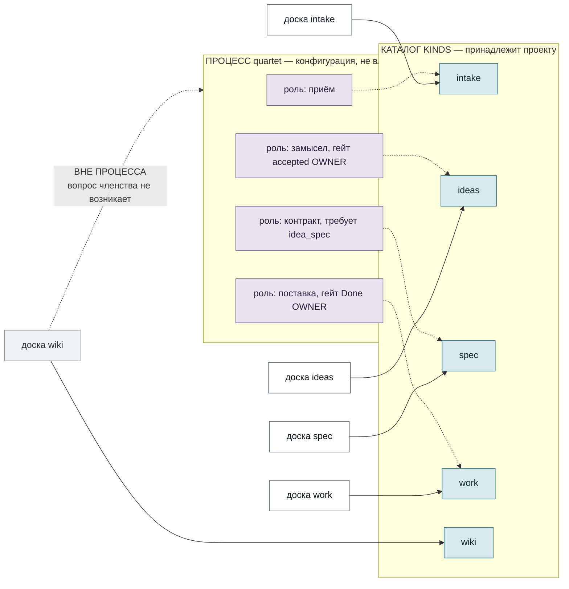
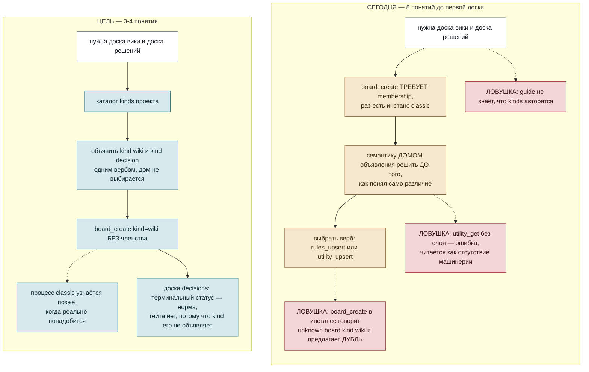
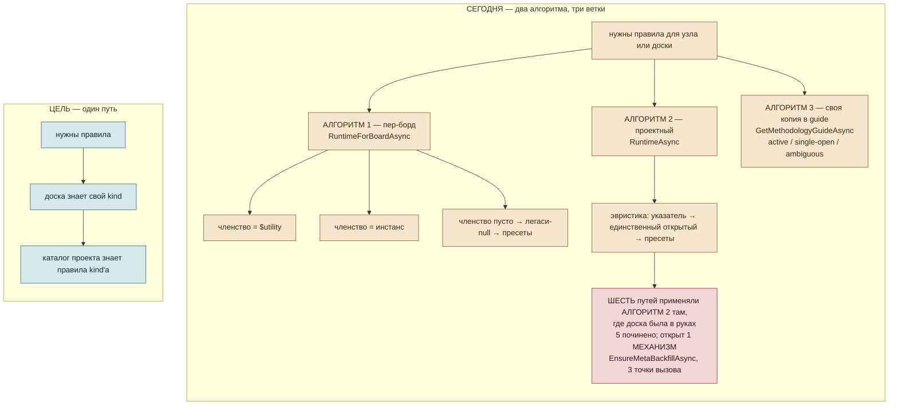
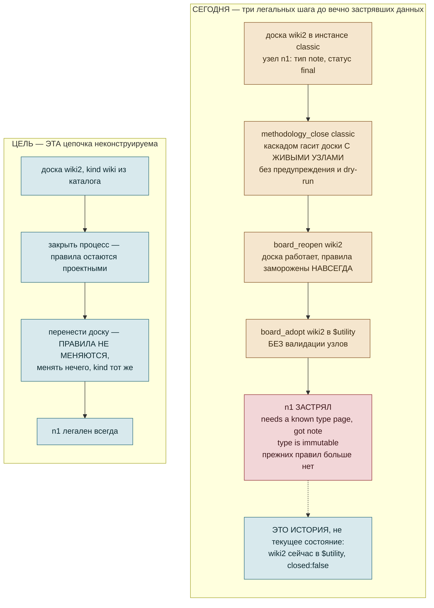

# Каталог вместо источников правил

Целевая модель kind'ов в PetBox: **kind принадлежит проекту, инстанс становится процессом.**

Это согласование двух идей в одну цель. Раньше они лежали порознь: аудит дал диагноз и
инкрементальный план, разбор путей дал альтернативы, но оставил цель как «направление C
(candidate, НЕ в этом accept'е)». Здесь C — **цель**, а A — **первая веха на пути к ней**,
а не конкурирующий вариант.

## Источники

| что | где |
|---|---|
| Диагноз, экспериментальная матрица, остаточные пути | `$system` / `work` / `kind-worlds-model-audit` (оба комментария) |
| Разбор путей, перепись когнитивной модели | `$system` / `ideas` / `kind-worlds-decision-paths` (в `review`) |
| Предыстория и уже выложенный фикс | `$system` / `client-issues` / `custom-kind-route-undiscoverable` (`4d956ad5`) |
| Живая репродукция | песочный проект `kind-resolution-lab` |

Диаграммы лежат отдельными файлами в `diagrams/` и продублированы здесь для чтения.
При расхождении источник истины — `.mmd`.

---

## Мера, которой меряем

Не «стало красивее», а **сколько понятий человек обязан удержать до первого полезного
действия** и **какие классы ошибок становятся невозможными**.

| | понятий до 1-й доски | скрытых понятий | классы ошибок, ставшие невозможными |
|---|---|---|---|
| Сегодня | 8 | 4 | — |
| Веха A | ~7 | 2 | дубли kind'ов **для новых записей** и только после решения Р-1 о scope уникальности (в `$system` уже лежит 6 коллизий); расхождение поверхностей |
| **Цель C** | **3–4** | **0** | дубли, ложь поверхностей, adopt-застревание, зомби-заморозка **через закрытие инстанса**. **НЕ устраняет** класс «застрявший узел» целиком — см. §6 |

Восемь сегодняшних: kind доски (и что kind ≠ доска), `methodology instance`, обязательное членство,
утилитарный слой, сентинел `$utility`, семантика домом объявления, выбор из двух верб'ов,
активный указатель. Четыре скрытых, всплывающих аварийно: легаси-null, пресеты-fallback,
два алгоритма резолвинга, неуникальность слага.

Асимметрия «вопрос → верб», измеренная на живом `$system`:

- «какие есть `rule source`?» — `tasks_methodology_list` **не показывает** `$utility`;
  доска `wiki` в перечне отсутствует вовсе;
- «какие kinds доступны?» — **верба нет**;
- «кто владеет kind X?» — **верба нет**, ответ через перебор;
- «какие правила у ЭТОЙ доски?» — после `4d956ad5` per-board поверхности честны
  (`tasks_workflow`, `tasks_search.kind`, резолвинг на UI-страницах досок). Нечестными
  остаются: сводный каталог (верба нет вовсе), `guide`, и **лейблы UI** — страницы досок
  резолвят верно, но подписывают доску из `$utility` как принадлежащую открытому инстансу.

---

## 1. Что на каком уровне живёт

### Сегодня

Правила берутся из **`rule source`** (источника правил), источник выбирается **членством
доски**, а какой это вид источника — кодируется **местом объявления** (`declaration home`).
Отсюда всё остальное.

### Цель

Доска → kind → правила, один прыжок. Вопрос «какой у этой доски `rule source`» **исчезает
из языка** — вместе с самим понятием.
Сегодняшние `$utility` и легаси-null сливаются в одно легальное состояние «вне процесса» —
минус два понятия одним движением, причём исходная семантика null оказывается правильной моделью.

---

## 2. Как раскладывается quartet с вики

Ключевое: **цепочка idea → spec → work остаётся ровно такой, какая есть.** Она перестаёт быть
свойством `rule source` и становится свойством процесса — то есть тем, чем она и является по смыслу.
Вики просто есть в каталоге; ей не нужно ни членство, ни выбор дома, ни второй верб.

Дубль `wiki` в правилах `quartet` под C **невозможно объявить** — каталог один.

---

## 3. Сценарий classic с вики и доской решений

Это ровно тот маршрут, на котором всё и вскрылось: проект `petsonde`, методология `classic`,
понадобились вики и запись принятых решений.

Три ловушки из четырёх, стоивших времени в `petsonde`, под C **не существуют как класс**:
дома нет, значит нет и выбора дома; каталог один, значит `board_create` не может назвать
объявленный kind несуществующим; `utility_get` без слоя не может быть тупиком, потому что
отдельного слоя нет.

---

## 4. Где упростится реализация

Что уходит из кода — не переписывается, а **умирает**:

| умирает | почему |
|---|---|
| `UtilityRuntimeAsync` | отдельного `rule source` нет |
| третья ветка `RuntimeForBoardAsync` (легаси-null) | «вне процесса» — легальное состояние, не аварийное |
| эвристика проектного runtime для досок | у доски всегда есть kind |
| dual-read оговорки по всему файлу | одно хранилище правил |
| отдельная пара верб'ов `utility_get` / `utility_upsert` | становятся вербами каталога |
| три хранилища полного документа — в трёх таблицах и трёх сервисах | схлопываются в каталог. **Архива сегодня НЕ существует**: `CloseAsync` пишет ту же строку той же таблицы с заполненным `ClosedAt`, ничего никуда не переносит. Под C читаемость правил закрытых процессов — либо новая сущность, либо флаг `closed` в каталоге (решение Р-2) |
| — **не срезается** | членство доски живёт в Core-БД, документы правил — в per-project tasks-файле. Пока граница Core / per-project стоит, cross-DB часть цены C остаётся |

Это и есть ответ на «а за ней должно подтянуться техническая часть, упростившись»:
каждая часть цели **срезает** код, ни одна не добавляет.

---

## 5. Что перестаёт быть возможным

`adopt-skips-live-node-validation` и `open-board-in-closed-world-zombie` (в части заморозки)
**растворяются, а не чинятся**. Узел `n1` живьём лежит в песочнице как доказательство.

> **Важная оговорка, добавленная после инвентаризации.** C устраняет только маршрут через
> `adopt` и закрытие инстанса. **Класс «застрявший узел» переживает C.** Найдена вторая
> цепочка, не требующая закрытия инстанса вовсе: `board_close` выводит закрытую доску из
> области валидации живых узлов (фильтр `b.ClosedAt is null`, в обоих сервисах) → `rules_upsert`
> спокойно выкидывает тип, на котором сидят её узлы → `board_reopen` возвращает доску без
> единой проверки. Под C то же строится как «закрыть доску → поменять каталог → reopen».
> Пока инстанс открыт, это **обратимо** (повторный `rules_upsert` лечит — проверено вживую);
> необратимым делает отсутствие у инстанса верба `reopen`. Настоящий корень —
> **невозможность открыть закрытый инстанс**, а не `adopt` и не `close` доски. Решения Р-3, Р-4.

---

## 6. Где мы поймаем ограничения

Честный список того, что цель НЕ решает и чем за неё платим.

| ограничение | цена / что делать |
|---|---|
| Уникальность слага запрещает «один слаг — разные правила в разных процессах» | В `$system` таких нет. При реальной нужде — переименование слага |
| Коллизии при миграции | **Только rename, никогда merge.** Доказательство — `n1`: merge производит такие узлы массово |
| Правила закрытых инстансов | Должны остаться читаемыми для истории → архив правил, не удаление |
| Активный указатель остаётся и под C | `active-get-dangling-closed-pointer` **не растворяется**, чинить руками |
| Каскад close | C не делает его говорящим; отдельная UX-задача |
| **Класс «застрявший узел» переживает C** | Цепочка `board_close` → правка каталога → `board_reopen` под C строится так же. Обратима, пока есть чем вернуть правила; необратима из-за отсутствия `methodology_reopen`. Решения Р-3, Р-4 |
| Архива правил закрытых процессов **не существует** | `CloseAsync` только проставляет `ClosedAt` в той же строке. Под C нужен либо флаг `closed` в каталоге, либо новая сущность с миграцией — решение Р-2 |
| Граница Core / per-project БД | Членство доски в Core-БД, документы правил — в per-project файле. Эта часть цены C **не срезается**, пока граница стоит |
| Оси тегов и словарь связей | Сегодня скоуп инстанса. Под C — к каталогу или к процессу? **Открытый вопрос** |
| Процессность как данные | Сегодня кодируется домом объявления. Под C должна стать полем процесса — самый содержательный разрыв со спекой `methodology-utility-kinds` |
| Аудит коллизий | Проведён **только по `$system`**. `petsonde` и остальные 8 проектов не проверены: цена C вне `$system` неточна |
| **Коллизий в `$system` шесть, а не одна** (уточнено `03-inventory/e-live-data.md`) | Живую доску задевает только `wiki`; пять дремлют в закрытых smoke-инстансах. Веха A нарушит собственное правило существующими данными в момент включения — нужно решение по области действия уникальности |

---

## 7. Порядок движения

Это настоящая последовательность, а не список — каждый шаг зависит от предыдущего.

1. **Дефекты шага 0** — сейчас, не дожидаясь решения по цели. Это безопасность живых данных:
   C их растворит, но C не завтра, а застрять можно сегодня. Уже заведены семью карточками
   на `work`.
2. **Снять дубль `wiki` из `quartet`** — обязателен при любом пути. Заблокирован: сначала
   починить то, что дубль маскирует (`meta-backfill`, ложь guide), иначе уборка **завозит**
   в `$system` два живых дефекта.
3. **Веха A — уникальность слага + единый каталог на чтение.** Дёшева, самостоятельно ценна,
   и является **строгим префиксом C**: и уникальность, и объединённое чтение C требует в любом
   случае, откатывать нечего. Побочно производит аудит коллизий по всем живым проектам —
   ровно те данные, на которых цена C станет точной.
4. **C** — на данных этого аудита.

**Никогда:** путь B (pinned-инстанс — крюк, который C снесёт); «умный» merge коллизий;
трогать `methodology-migrate-content`.

---

## 8. Что меняется в спеке

### Сейчас, вехой A

| лист | правка |
|---|---|
| `methodology-utility-kinds` | +клауза: kind-слаг ДОЛЖЕН быть уникален в проекте поверх всех домов; повторное объявление ДОЛЖНО отклоняться с указанием дома-владельца |
| `methodology-kind-catalog` (**новый**, child `methodology-board-membership`) | проект ДОЛЖЕН отвечать «какие kinds объявлены и кем» одной поверхностью; доска утилитарного слоя НЕ ДОЛЖНА быть невидимой для листинга `rule source` |

### Целью C

| лист | судьба |
|---|---|
| `methodology-instance-model` | переписывается: инстанс = конфигурация процесса, правила уходят проекту |
| `methodology-board-membership` | переписывается: «не более одного процесса», adopt без смены правил |
| `methodology-utility-kinds` | **поглощается** каталогом; принцип «различие домом объявления» депрекейтится |
| `methodology-instance-close` | переписывается: закрытие процесса не замораживает правила |
| `methodology-instance-scoped-axes` | **решение владельца**: оси к каталогу или к процессу |
| `methodology-active-instance` | **зависит от вопроса владельцу №3.** Ранее здесь стояло «сохраняется» — это противоречило собственному списку открытых вопросов сводки |
| `methodology-migrate-content` | не трогается |

---

## Открытые вопросы владельцу

1. Оси тегов и словарь связей под C — к каталогу или к процессу?
2. Закрытие процесса: доски закрывать или отвязывать в «вне процесса»?
3. Нужен ли активный указатель под C, или «процесс по умолчанию» — свойство доски?
4. Аудит коллизий в `petsonde` и остальных проектах — вашим ключом; песочный туда не пускает.
